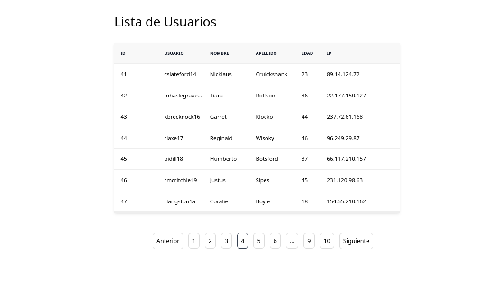

<h1 align="center">User List</h1>

<div align="center">
   Simple user list made with  <a href="https://react.org" target="_blank">react</a>.
</div>

<div align="center">
  <h3>
    <a href="https://github.com/Dave136/user-list">
      Demo
    </a>
    <span> | </span>
    <a href="https://github.com/Dave136/image-uploader">
      Source
    </a>
  </h3>
</div>

<div align="center">
  
</div>

<!-- TABLE OF CONTENTS -->

## Table of Contents

- [Overview](#overview)
  - [Built With](#built-with)
- [How to use](#how-to-use)
- [Contact](#contact)

<!-- OVERVIEW -->

## Overview



This is a simple app, with a little bit of features

You can see a [demo](https://reactjs-users-list.netlify.app/)

### Built With

- [react](https://reactjs.org/)
- [axios](https://axios-http.com/)
- [tailwind](https://tailwindcss.com/)
- [react-base-table](https://autodesk.github.io/react-base-table/)
- [react-paginate](https://www.npmjs.com/package/react-paginate)


## How To Use

To clone and run this application, you'll need [Git](https://git-scm.com), [Node.js](https://nodejs.org/en/download/) (which comes with [npm](http://npmjs.com)) and [Pnpm](https://pnpm.io/installation) installed on your computer. From your command line:

```bash
# Clone this repository
$ git clone https://github.com/Dave136/user-list.git

# Install dependencies
$ pnpm install

# Run the app
$ pnpm dev
```

## Contact

- Website [dave136.netlify.app](https://dave136.netlify.app/)
- GitHub [@dave136](https://github.com/Dave136)
- Twitter [@davejs4](https://twitter.com/davejs4)
